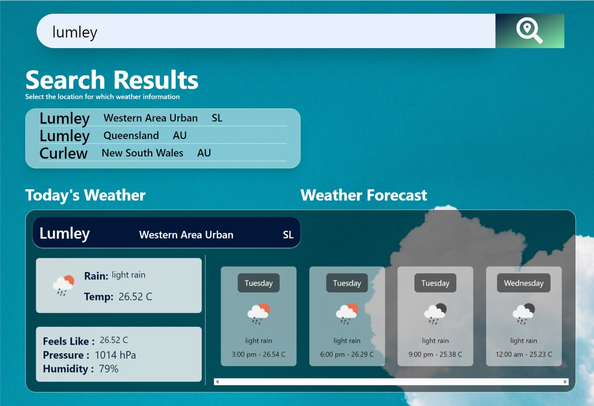

<p align="center">
  
</p>

# <p align="center">Save Your Home WEATHER APP</p>

> This is a web app that helps people keep track of the weather conditions of every place on earth.

It gives details on both current and future weather conditions of locations inputed by users.

__You can check it out on here:__
* [The Landing Page for the weather app](https://moonlit-haupia-4f486e.netlify.app "landing page")
* [The Weather App](https://lustrous-piroshki-2a1d02.netlify.app "save your home weather app")

There is also a blog post that explains in detail how this project was built. You can find it here:
* [The Story Of My First Web App](https://medium.com/@www.mariamzombo/the-story-of-my-first-web-app-912aef522f75 "the blog post")
## Usage

1. Enter the location that you want weather data for and click the search button or the **ENTER** key on your key board.
2. Your browser's display will change to a page with a search button and a list containing the results of at most five places, that match the location you entered. _By defualt the app displays the weather condition of the first location that matches your input_.
3. To see the weather info for any of the listed locations **CLICK** it, and the info will be displayed in the content section below the search button
4. For _desktops and tabs_ the left of the content section contains the current weather condition for the selected location and the left contains a 12 hour weather forecast at intervals of 3 for the selected location.
5. For _smart phones_ the top of the content section contains the current weather condition for the selected location and the bottom contains a 12 hour weather forecast at intervals of 3 for the selected location.
   
**NOTE**: <br>
Country name codes are used instead of the country names. Example "Sierra Leone" becomes "SL". You can use a third party application to convert counrty name codes to country names.

The speed of your internet affects the app's load time.

The accuracy of the weather data is dependent on the Open Weather APIs used.

## A Glimpse of The App



## Code Snippets of Core Algorithm

Part of the HTML code that takes input from users.
```html
<form  id="myForm" action="" method="POST" class="w-full h-full flex items-center justify-center">
    <input type="text" name="place" class="w-5/6 h-10 md:h-20 text-xl md:text-4xl p-4 pl-5 md:pl-9 focus:outline-green-400 shadow-2xl" placeholder="Enter the region or area">
    <button type="submit" id="search_btn">
        <div class="flex items-center justify-center text-white h-10 md:h-20 w-20 md:w-40 bg-gradient-to-br from-oxford_blue to-green-300"></div>
    </button>
</form>
```

Part of the javascript code that sends user inputs to the open Weather API and dynamically displays data to users.
```javascript
fetch(`https://api.openweathermap.org/geo/1.0/direct?q=${area}&limit=7&appid=${API}`)
    .then(res => res.json())
    .then(data => {
        // Checks if there is data available for the location entered
        if (Object.keys(data).length === 0) {
            output.innerText = "";
            output.innerText = "No results found from Open Weather";
            output.nextElementSibling.classList.add("hidden");
        }
        else {
            output.innerText = "Search Results";
            output.nextElementSibling.classList.remove("hidden");
        }

        for (let each of data){
            const divElement = document.createElement('div');
            divElement.className = 'w-full h-1/5 flex items-center border-b border-white hover:cursor-pointer';

            // checks if the name, state and country of a location is undefined
            if (each['state'] == undefined) {
                each['state'] = "";
            }
            if (each['name'] == undefined) {
                each['name'] = "";
            }
            if (each['country'] == undefined) {
                each['country'] = "";
            }
            
            // creates of a list of places with the same name
            divElement.innerHTML = 
            `
            <p class="text-xl md:text-4xl pr-8" id="place">${each['name']}</p>
            <p class="md:text-2xl pr-8" id="state">${each['state']}</p>
            <p class="md:text-2xl pr-8" id="country">${each['country']}</p>
            `
            display.appendChild(divElement)
```

## Technologies Used
* [x] Tailwindcss: for designing the app
* [x] Open Weather API: to get weather data
* [x] HTML and Javascript (Programming languages): for functionality and structure.
## What Inspired This Project (My Story)

>This project was inspired by my drive to solve one of __UN'S GLOBAL GOALS__. 

Since tackling climate change is one of them I decided to build a web app that helps people to keep track of their communities' climate conditions and guide them on actions to take in other to save their communities from adverse climate change. 

As a starting point, I have built this weather app to help people keep track of the weather conditIons of every place on earth, for it is one of the major factors in monitoring our planet's climate.

## Process And Timeline

>It wasn’t smooth nor easy. 

The process wasn't smooth as everything was built from scratch, excluding the API. 
It got frustrating at some point and sometimes I wish someone was there to help me. 
If I had a teammate the project would have been finished earlier, with a more beautiful user interface and experience.

> I built the app in approximately nine days

The time set for the project was more than the time I spent on it, this was because I thought it was compulsory to build the maze project which I was not interested in. 
So I had wasted some of my time on going about the maze project. By the time I realized it was optional and made a change to the project, time was not in my favor, so I had to go on hyper productive mood. 

